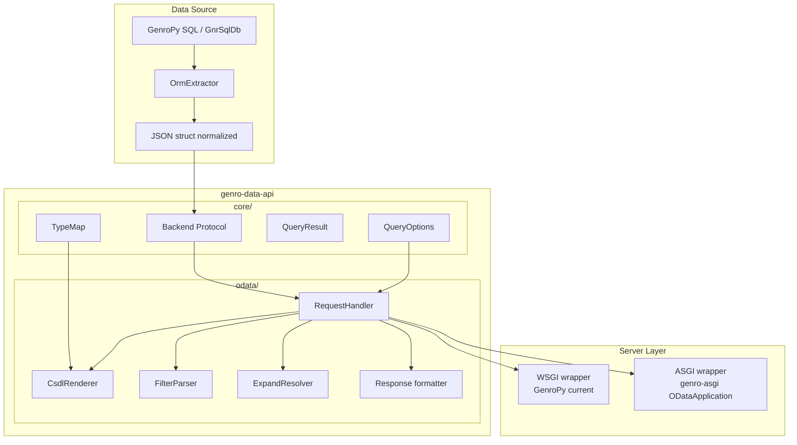

# Architecture

**Version**: 0.1.0
**Last Updated**: 2026-04-16
**Status**: DA REVISIONARE

## Design Goals

1. **Server-agnostic**: the request handler receives `(method, path, query_params)` and returns `(status, headers, body)`. Any server (WSGI, ASGI, or test harness) can call it.

2. **Protocol-extensible**: OData v4 is the first protocol. GraphQL can be added as a sibling package (`graphql/`) sharing the same core.

3. **Read-only first**: initial scope is safe data exposure. Write operations (POST/PATCH/DELETE) are a future opt-in.

4. **Zero core dependencies**: the `core/` package uses only Python stdlib and typing. Backend implementations import framework-specific code.

## Layer Diagram



## Package Structure

### core/

Shared definitions used by all protocol implementations.

- **`backend.py`** — `DataApiBackend` Protocol class defining the contract any data source must implement. Plus `QueryOptions` and `QueryResult` dataclasses.

- **`type_map.py`** — Mapping from GenroPy dtype codes to standard type systems (OData Edm types, GraphQL scalars). This is the single source of truth for type translation.

### odata/

OData v4 protocol implementation.

- **`request_handler.py`** — The central dispatcher. Receives `(method, path, query_params)`, routes to the appropriate handler (`$metadata`, entity set query, single entity fetch), returns `(status_code, headers, body)`.

- **`csdl_renderer.py`** — Converts the normalized JSON struct (from OrmExtractor) into OData CSDL XML. Uses `type_map` for dtype-to-Edm translation. May use genro-bag's XML serialization.

- **`filter_parser.py`** — Parses OData `$filter` expressions into structured filter objects that the backend can translate to native queries. Examples: `Price gt 20`, `contains(Name,'widget')`, `Status eq 'active' and Date ge 2024-01-01`.

- **`expand_resolver.py`** — Translates OData `$expand` directives into backend-specific relation expansion. Maps OData navigation properties to GenroPy `@relation` syntax.

- **`response.py`** — Wraps query results in OData JSON format with `@odata.context`, `@odata.count`, `@odata.nextLink`.

## Backend Protocol

```python
class DataApiBackend(Protocol):
    def entity_sets(self) -> list[dict]: ...
    def entity_metadata(self, entity_name: str) -> dict: ...
    def query(self, entity_name: str, options: QueryOptions) -> QueryResult: ...
    def get_entity(self, entity_name: str, key: Any) -> dict | None: ...
```

This is **read-only by design**. Write methods (`create`, `update`, `delete`) will be added as an optional extension when needed.

## Request Handler Flow

```
HTTP Request
    |
    v
RequestHandler.handle(method, path, query_params)
    |
    +-- GET /$metadata --> csdl_renderer.render(backend.entity_metadata())
    |
    +-- GET /EntitySet --> filter_parser.parse($filter)
    |                      expand_resolver.resolve($expand)
    |                      backend.query(entity, options)
    |                      response.format(result)
    |
    +-- GET /EntitySet(key) --> backend.get_entity(entity, key)
    |                           response.format_entity(result)
    |
    +-- POST/PATCH/DELETE --> 405 Method Not Allowed
    |
    v
(status_code, headers, body)
```

## Type Mapping

| GenroPy dtype | OData Edm Type | Python type |
|---|---|---|
| A (text) | Edm.String | str |
| T (text long) | Edm.String | str |
| C (char) | Edm.String | str |
| N (numeric) | Edm.Decimal | Decimal |
| I (integer) | Edm.Int32 | int |
| L (long) | Edm.Int64 | int |
| R (float) | Edm.Double | float |
| B (boolean) | Edm.Boolean | bool |
| D (date) | Edm.Date | date |
| DH (datetime) | Edm.DateTimeOffset | datetime |
| H (time) | Edm.TimeOfDay | time |
| X (xml/bag) | Edm.String | str |

## Reuse of GenroPy OrmExtractor

The model metadata is extracted using the existing `OrmExtractor` from `gnr.sql.gnrsqlmigration`. This produces a normalized JSON structure with:

- Schemas, tables, columns (with dtype, size, notnull, unique)
- Relations (foreign keys with target table, on_delete)
- Constraints and indexes

This is the same format used by the migration system, already tested and stable. The CSDL renderer consumes this JSON struct and translates it to OData metadata.

## Server Integration

### WSGI (GenroPy current)

```python
from genro_data_api.odata import ODataRequestHandler

class ODataController:
    def __init__(self, db):
        adapter = GnrSqlODataAdapter(db)
        self.handler = ODataRequestHandler(adapter)

    def serve(self, environ):
        method = environ['REQUEST_METHOD']
        path = environ['PATH_INFO']
        query = parse_qs(environ['QUERY_STRING'])
        status, headers, body = self.handler.handle(method, path, query)
        # return WSGI response
```

### ASGI (genro-asgi)

```python
from genro_data_api.odata import ODataRequestHandler

class ODataApplication(AsgiApplication):
    def __init__(self, **kwargs):
        self.handler = ODataRequestHandler(kwargs['backend'])
        super().__init__(**kwargs)

    async def __call__(self, scope, receive, send):
        status, headers, body = self.handler.handle(
            scope['method'], scope['path'],
            parse_qs(scope['query_string'])
        )
        # send ASGI response
```

## Implementation Phases

### Phase 1 — Core + Scaffolding (current)
- Project structure, CI/CD, documentation
- Protocol definitions (`DataApiBackend`, `QueryOptions`, `QueryResult`)
- Type mapping table

### Phase 2 — OData Read-Only
- `$metadata` endpoint (CSDL XML generation)
- `$filter` parser (basic operators: eq, ne, gt, lt, ge, le, and, or, not, contains, startswith, endswith)
- `$select`, `$orderby`, `$top/$skip`, `$count` support
- `$expand` for one-to-one relations
- OData JSON response formatting
- Request handler with routing

### Phase 3 — GenroPy Adapter
- Concrete `DataApiBackend` implementation using GnrSqlDb
- WSGI wrapper for GenroPy sites
- Integration tests with real database

### Phase 4 — Advanced OData
- `$expand` for one-to-many relations
- `$apply` aggregations (groupby, aggregate)
- `$batch` support
- Server-driven paging (`@odata.nextLink`)

### Phase 5 — Write Operations (optional)
- POST (create entity)
- PATCH (update entity)
- DELETE (delete entity)
- Transaction support via `$batch`

### Phase 6 — GraphQL (future)
- `graphql/` package alongside `odata/`
- Schema generation from same backend Protocol
- Query resolver using same `QueryOptions`
